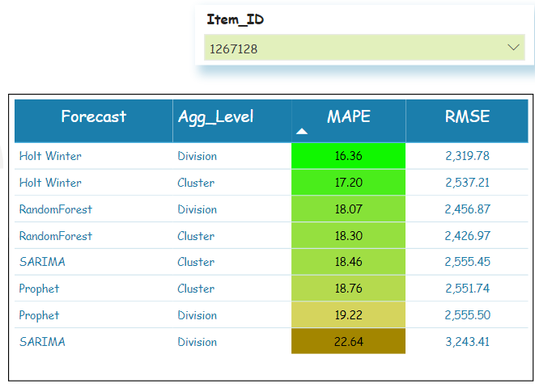
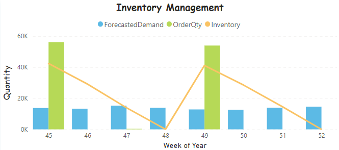

```{r global_options, include=FALSE}
knitr::opts_chunk$set(fig.pos = 'H')
```

\newpage
# 1. Introduction

The goal of the project is to develop a demand forecasting tool to find the best levels of aggregation and the best forecasting technique that can be used to predict weekly demands for a leading Food Processing Company based in North America. The company has several warehouses across USA and Canada, which they use to source retailers and distribution centers across North America. As a complementary service, we have also developed an inventory optimization tool using Integer Linear Programming. Our aim is to improve their production plan for the coming horizons by giving them better forecasts and streamline their inventory levels. 

The company have given us a partial database, with information concerning the actual demand history (univariate time-series dataset) for all the products manufactured in the year 2019. The data at hand is composed of 2407 SKUs, and each of these items fall into one of 4 unique production division categories (CA-FS, CA-RTL, US-FS, and US-RTL). To decrease the variability in the dataset and computational complexity, the company suggested developing forecast models at aggregated levels and then later disaggregate them to get individual product demands for each SKU’s.  

Division level category assignment is being made by the company based on business intuition and product sense. But since SKU’s having different trends and seasonality can get aggregated together under the same division, we believe this will decrease the overall influence of the time series components and thereby reducing its forecasting power. From our research we learned that time-series clustering can be an alternative solution to this problem, because this enabled us to group together items having similar demand patterns. Therefore, we are performing demand forecasting on two different levels of aggregation – **1) Division level and 2) Cluster level** – for building our predictive models.  

In order to analyze the forecast results and develop our prescriptive inventory solution, we have used only the top 5 items by quantity from each divisions (20 items in total). We based this idea off the popular Pareto principle, and we have assumed that this will give us a near accurate representation of the overall data. The forecast models were then developed using 80% of data as the train set and the remaining 20% as the test set. The overall performance of models were compared using the test-set and we have used this half of the data for the inventory model. The inventory optimization model was developed using an Integer Linear Programming algorithm for the last 8 weeks of 2019 (test set).  


# 2. Methodology

To develop the forecasting tool for the project, we have used 4 time-series based forecasting techniques; Holt-Winter’s, SARIMA, Prophets, and Random Forrest at 2 levels of aggregation – Division and cluster. For comparing the results, we are using Root Mean Square Error (RMSE) and Mean Absolute Percentage Error (MAPE) as secondary metrics. But since different items have different scales of demand, we have used MAPE as our primary metric for comparison. This is also because MAPE will be easier to explain from a business perspective.  

Before developing the forecast models, data pre-processing and time-series clustering was done to group the SKU’s into the 2 levels of aggregation which we have mentioned earlier. The aggregated forecasts were then broken down into their respective SKUs using a fixed scaling factor, and the best results for each SKU (based on MAPE) was taken as input for the Inventory Optimization model.

## Time-series Clustering

The key idea of clustering is to segregate similar data points together to perform further analysis. We are extending the same principle here to time-series data, for grouping SKUs similar demand patterns into different groups. Since time-series data have a time component, Euclidean distance (ED) might not always be a good measure for calculating similarity. Because it will only calculate the distance between data points at their respective time phase. Therefore, we are using Dynamic time warping (DTW) as the alternate distance metric. DTW can calculate similarity between differently aligned time-series patterns because it calculates the distance along the time dimension using a non-linear warping path.


Based on the DTW distance metric, we performed time-series clustering using different techniques: agglomerative clustering using single linkage, agglomerative clustering using ward linkage, and K-Means clustering. Silhouette scores and cluster plots were then drawn to evaluate these clusters.


 

From the elbow curves in Figure 3, we chose 4 as the number of clusters for K-Means. Number of clusters for the other clustering techniques were chosen according to their respective Dendrograms. Upon comparison, K-means gave us the best results and we decided to use these Cluster IDs as the second level of aggregation for use in the forecast models. 

```{r echo=FALSE, fig.cap="Output of Time-Series Clustering (K-Means)", fig.show="hold", out.height="65%"}
knitr::include_graphics("./Images/kmeans.png")
```


## Demand Forecasting

In order to forecast the demand for a particular level of aggregation, the first step was to study the different time-series decomposition plots.  Decomposition plots helped us analyze how the data was being represented in terms of its time-series components (seasonality and trend). Since we had limited availability of data, the seasonal patterns were difficult to interpret. However, we have decided to add a seasonal period of 13weeks(1 quarter) in our time-series models. This was chosen according to the results we obtained from GridSearch - when optimizing the results for SARIMA, and also based on business logic. This seasonal period may be prominent because we have just one year of data, and if we had more, then yearly seasonal components might just override this effect that is being highlighted. 

```{r echo=FALSE, fig.cap="Time-Series Decomposition Plots: a) CA-FS, b) Cluster 3", fig.show="hold", out.width="50%"}
knitr::include_graphics("./Images/Division-CARTL.png")
knitr::include_graphics("./Images/ClusterID_2.png")
```


We performed the same decomposition analysis for all divisions and cluster levels, and learned that there is a clear seasonality and trend in weekly aggregated demands as evident from plots in Fig 5. In order to capture both these characteristics of time series data, we forecasted the demand using time-series models that perform well under similar conditions: **1. Holt Winter 2. SARIMA, and 3. FB-Prophets**. We then also explored the capability of **4. Random Forest** in time-series based forecast predictions, as our research suggested that it could give reliable results.

### a) Holt Winter
Holt Winter's model was used to capture the suspected seasonality and trend in the demand patterns. We analyzed the results for both additive and multiplicative holt winter models, and found that the forecast results were better for additive models. Hence we used it as our base model for demand forecasting. 

### b) SARIMA
Seasonal Autoregressive Integrated Moving Average (SARIMA) is a very efficient univariate time-series forecasting method. In order to use a SARIMA model, we must determine the values of its parameters (p, d, q) that capture the trend component of the time-series, and parameters (P, D, Q, m) that determine the seasonal components. To find the trend parameters p and q, we used PACF and ACF plots from Figure 6. This was done for all levels of aggregation, and we have found that the values of p and q were the same for all. 

```{r echo=FALSE, fig.cap="a) ACF Plot, b) PACF Plot", fig.show="hold", out.width="50%"}
knitr::include_graphics("./Images/ACF_plot.png")
knitr::include_graphics("./Images/pacf_plot.png")
```

The value for parameter d - level of trend differencing required to make the data stationary was determined from the differencing plot in Fig 7. Stationarity of the time-series datasets were then confirmed using Augmented Dickey fuller test where we got a significant p-value for first difference. From these verifications, we concluded d=1. This was also confirmed to be the same for all levels of aggregation. 


To find the optimal values for seasonality parameters (P,D,Q,m) that gave the best forecast results, we ran a grid search algorithm over a pre-determined range for all levels of aggregation. The hyperparameters that gave the lowest AIC value were found for each of the divisions and clusters. All seven optimal hyperparameters were then given as input to the model function and the demand was forecasted. 

### c) Prophet
Facebook’s open-source time-series forecasting model is another technique that deals well with univariate and multivariate time-series datasets having seasonal and trend components. It is a Generalized additive model (GAM), that is very robust in handling shifts in trends and we also have the flexibility to specify seasonal periods and change points. Since we have noticed that there is a weekly seasonality with periodicity of 13, we have also added that to the FB-prophet models. 

### d) Random Forest
Random Forest is a very effective ensemble technique used in supervised machine learning problems. However, like any other supervised learning algorithm, it requires a set of input features to make predictions on the target variable. But since ours is a univariate time-series dataset, it does not have any other input variables. Therefore, the data had to be first transformed into a supervised learning problem. This was done by restructuring the dataset to take quantities from previous weeks as input variables to predict the demands for the next week. 

```{r echo=FALSE, fig.cap="Time-Series transformation: Sliding window representation", fig.show="hold", out.height="65%"}
knitr::include_graphics("./Images/Random Forest.png")
```

Also, this method of time-series forecasting requires a technique called walk-forward validation for evaluating the results on the test set. Because you cannot use data which you do not have at the time of prediction when forecasting for the next period. 

**Forecast Disaggregation**  

Once the forecasts were calculated at both division and cluster levels, we disaggregated the data to its respective SKU level. This was done using the fixed proportions we calculated based on percentage contributions of each SKU to the total quantity of the aggregation level.  We have only considered one method of disaggregation in this project, but we have identified a scope to experiment with different disaggregation techniques in future extensions of the project. 

## Inventory Management 
Reasonable assumptions were made for inventory holding costs and ordering costs for the 20 SKU’s selected to make the inventory optimization models. Integer Linear Programming models (Short path method) were implemented using Pyomo and glpk libraries to find the optimal order quantities and ordering periods for these SKU’s based on the quantity and demand constraints. Since we did not consider capacity constraints, a Big M constraint was placed on the order quantities to achieve optimality. The objective function and the constraints were formulated to minimize the total ordering and holding costs for these products.

$$ Min: Co*\sum_{i=1}^{8} Y_i + Ch*\sum_{i=1}^{8} S_i $$
**Constraints**
$$ S_0 = 0 $$
$$ Q_i+S_{i-1} - S_i =D_i$$ 
$$ Q_i <= M*Y_i$$     
$$Y_i \in [0,1]$$      
$$i \in [1,8]$$
Since we did not have accurate information about the costs, the prescriptive solution is currently a prototype. However, this is an excellent reference for when the company wishes to implement the solution using the current product costs. 

\newpage
# 3. Results
## Predictive

Best performing forecasting technique and the corresponding level of aggregation for each SKU was calculated by comparing the results of the forecast models. This analysis was done based on the different MAPE values, the aggregation level and forecasting technique that gave the lowest value for MAPE was selected as the best forecasting model for that SKU. The table below (Figure 10) shows the performance of all forecasting techniques for the selected Item ID. 

```{r echo=FALSE, fig.cap="SKU level forecast results", fig.show="hold", out.height="35%"}

```
From the table in Figure 10, we can propose that for Item ID-1267128, the best performing forecast model is Holt Winter when forecasted at division level aggregation. Similar analysis was carried out for all the SKUs considered in the scope of study and the following results table consolidates the best techniques identified for each SKU. 

```{r echo=FALSE, fig.cap="Best performing model for each SKUs", fig.show="hold", out.height="65%"}
knitr::include_graphics("./Images/Result2.png")
```


For the scope of our study, we have only chosen 20 items; top 5 items based on quantity from each of the 4 divisions (US FS, US RTL, CA FS, and CA RTL). We found out that amongst all the forecasting methods used by us, FB-Prophet gave the most accurate results. But this can change if you retrain the models with more data. Also, aggregating the data by cluster level resulted in better forecasts for 65% of items, as represented by this donut chart below. 


We then examined whether the predicted demands from the best performing models can capture the time series elements for our targeted SKUs. The demand forecasting plots at SKU level, similar to those below, were plotted to study results from the predictive models. 

```{r echo=FALSE, fig.cap="SKU level Demand Forecasting plot for best performing model of two items", fig.show="hold", out.height="65%"}

```
We can see from the line plots in Figure 12 that the predictions for the test data are closely representing the actual demand for that period and are reasonably accounting for both the trend and seasonality in the demand patterns. 

## Prescriptive
Inventory optimization models were developed using the forecasted demands from predictive models as input for each of the 20 SKUs. Since the results are based on our inventory and holding cost assumptions, and we do not have information on the company's current holding policies, we have refrained from making cost-benefit recommendations from the prescriptive tool. However, we have made the tool in such a way that these cost values can be easily adjusted for each SKU when the company decides to test its performance. 

Based on the current inputs, a sample output from the inventory model is shown in Figure 13.
```{r echo=FALSE, fig.cap="Inventory Management results table", fig.show="hold", out.height="65%"}
knitr::include_graphics("./Images/Result5.png")
```
```{r echo=FALSE, fig.cap="Inventory Management Plot", fig.show="hold", out.height="65%"}

```


# 4. Conclusion
For quickly analyzing forecast predictions and inventory management solutions by the company, we have also provided a Power BI dashboard which can be extended to all the products manufactured by them. The Dashboard provides the demand planner with the demand forecasting plot of the best performing model by item. A comparison table consisting of aggregation levels and different forecasting models along with their performance measures (RMSE and MAPE) is provided. Inventory management and several other plots depicting the performance of proposed models are presented in the Dashboard for comprehensive analysis. 

From our analysis, we observed that there is no one fit all forecasting technique that works for every SKUs, but FB-Prophet gave the best result for majority of the SKUs. The different forecasting models can also be combined using an optimal weightage factor to increase the accuracy of prediction even further; but this is beyond the scope of our current project. Moreover, the results also showed that the cluster level aggregation is giving better forecast accuracies. However, we cannot give a conclusive suggestion regarding the best technique and the aggregation level the company should adopt because our models were limited to just a year (52 weeks) of data. To give a more accurate recommendation, we would need to retrain the models with historical data from more years, so that the seasonal patterns and trends can be better represented by the predictive algorithms.  

However, the predictive and prescriptive developed by us, and the dashboard are dynamic and can be easily adopted to include several years of historical data. This demand forecasting and inventory optimization tool we developed will be a great testimony for the company if they wish to implement these solutions on a large scale.  

# 5. References

•	Coffey, C. (2013, March 28). Of Data and Science: Capital Bikeshare: Time Series Clustering. Of Data and Science. http://ofdataandscience.blogspot.com/2013/03/capital-bikeshare-time-series-clustering.html

•	Jiang, G., Wang, W., & Zhang, W. (2019). A novel distance measure for time series: Maximum shifting correlation distance. Pattern Recognition Letters, 117, 58–65. https://doi.org/10.1016/j.patrec.2018.11.013

•	Jupyter Notebook Viewer. (n.d.). Retrieved April 1, 2022, from https://nbviewer.org/github/jckantor/ND-Pyomo-Cookbook/blob/master/notebooks/02.01-Production-Models-with-Linear-Constraints.ipynb

•	Rakthanmanon, T., Campana, B., Mueen, A., Batista, G., Westover, B., Zhu, Q., Zakaria, J., & Keogh, E. (2012). Searching and mining trillions of time series subsequences under dynamic time warping. Proceedings of the 18th ACM SIGKDD International Conference on Knowledge Discovery and Data Mining - KDD ’12, 262. https://doi.org/10.1145/2339530.2339576

•	Random Forest for Time Series Forecasting for Data Science. (2021, June 2). Analytics Vidhya. https://www.analyticsvidhya.com/blog/2021/06/random-forest-for-time-series-forecasting/

