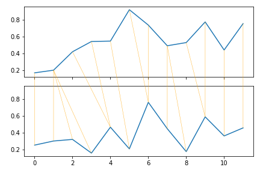
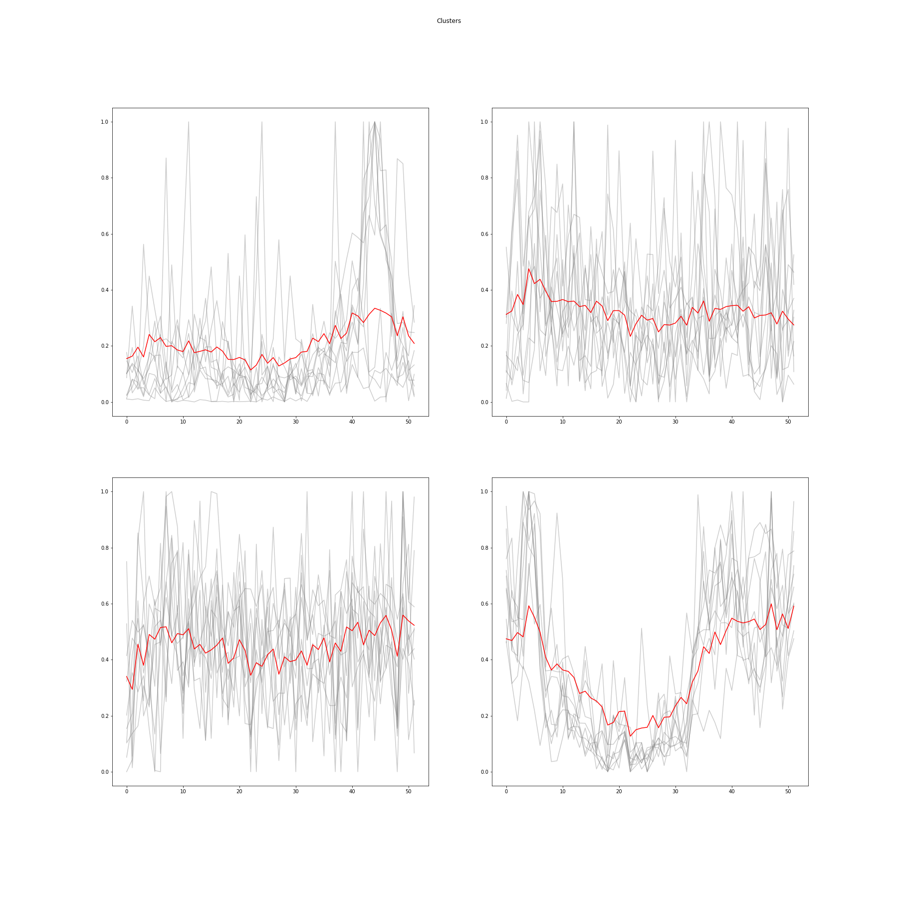
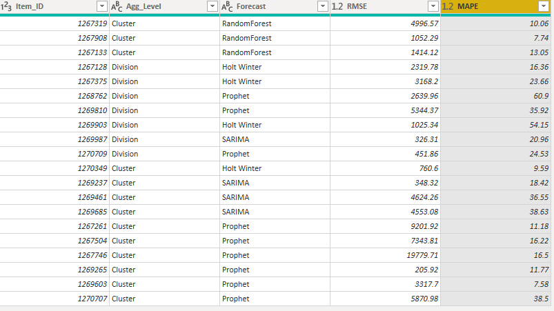

## 1. Introduction

The goal of the project is to develop a demand forecasting tool to find the best level of aggregation and the best forecasting technique that can be used to predict weekly demands for a leading Food Processing Company based in North America. The company has several warehouses across USA and Canada which they use to source retailers and distribution centers across North America. As a complementary service, we have also developed an inventory optimization tool using Integer Linear Programming. Our aim is to improve their production plan for the coming horizons by giving them better forecasts and streamlining their inventory levels.
The company has provided us with the actual demand history for all products manufactured in the year 2019 to build our analysis. They had manufactured 2407 SKUs in that year and each of these items fell into a unique production division category. To decrease the variability in the dataset and computational complexity, the company suggested developing forecast models at aggregated levels and then later disaggregate them to get individual product demands for each SKU’s. 
Division level category assignment is being made by the company based on business intuition and product sense. Since SKU’s having different trends and seasonality can get aggregated together under the same division, we believe this will decrease the overall influence of time series components and thereby affecting forecast accuracies. From our research we learned that time-series clustering can be an alternative solution to this problem because this will enable us to group together items having similar demand patterns. Therefore, we are performing demand forecasting on two different levels of aggregation – Division level and Cluster level – for building the predictive models. 
We have only used the top 5 items by quantity, for the 4 Division’s, (20 items in total) to analyze the forecast results and develop the prescriptive inventory optimization model. We have assumed that this will give us a nearly accurate representation of how the overall data behaves for the remaining SKUs. The forecast models were developed using 80% of data as train set and the remaining 20% was used to test its overall performance. The integer linear programming model was then developed using the forecast results as predicted demand for the last 8 weeks of 2019. 

## 2.Methodology

To develop the forecasting tool for the project, we have used 4 time-series based forecasting techniques, Holt-Winter’s, SARIMA, Prophets, and Random Forrest at 2 levels of aggregation – Division and cluster. The selection of the best Forecast models was determined using Root Mean Square Error (RMSE) and Mean Absolute Percentage Error (MAPE). But since different items have different scales of demand, we have used MAPE as our primary metric for comparison. 
Before developing the forecast models, data preprocessing and time-series clustering was performed to segregate the Item’s into the 2 level’s aggregated stages that we have mentioned earlier. The aggregated forecasts were then broken down into respective SKUs using a fixed scaling factor and the best results for each SKU based on MAPE were taken as input for the Inventory Optimization model

### Time-series Clustering

The key idea of clustering is to classify similar data points together to perform further analysis. We are extending the same principle here to time-series data for classifying similar demand patterns into different groups. Since time-series data have a time component, Euclidean distance (ED) might not always be a good measure for calculating similarity. Because it will only calculate the distance between data points at their respective time phase. Therefore, we are using Dynamic time warping (DTW) as our distance metric. DTW can calculate similarity between differently aligned time-series patterns because it calculates the distance along the time dimension using a non-linear warping path.

Based on the BTW distance metric, we performed time-series clustering using different techniques, agglomerative clustering using single linkage, agglomerative clustering using ward linkage, and K-Means clustering. Based on the silhouette scores and cluster plots, K-Means clustering was giving the best results. 

 

From the elbow curves, we decided to choose 4 as the number of clusters for K-Means. Also, since K-means gave us the best result, we decided to use these Cluster IDs as the next level of aggregation for use in the forecast models.

### Demand Forecasting
For forecasting the demand of a particular aggregation level, we analyzed the decomposition plots separately. Decomposition plot splits the time series data into seasonality and trend components.
The decomposition plot below is for division CA-FS and cluster ID -03.

We analysed such decompositon plots for all divisions and clusters. We understood that there is seasonality and trend in weekly aggregated demands which is clear from the seasonal and trend sections of both plots. In order to capture both of these characteristics of time series data, we forcasted the demand using the following models:
1.Holt Winter 2. SARIMA 3. Prophet 4. Random Forest

**Holt Winter**
We used this model to capture the suspected seasonality and trend and forecasted demand on that basis. We analyzed the results for both additive and multiplicative holt winter models. We found that the forecast results were better for additive model, hence we used it as our base model for demand forecasting.

**SARIMA**
SARIMA stands for Seasonal Autoregressive Integrated Moving Average. To forecast the demand using SARIMA model, three hyperparameters p,d,q that captures trend and four hyperparameters P,D,Q,m that captures seasonality were given as an input to the model. In order to find the hyperparameters capturing trends we analyzed the following pacf and acf plots.

From these plots we got the hyperparameters p,q for each division and cluster depending on aggregation level. In order to verify the stationarity of data we analyzed the plot of data with first difference

From the plot, we can see that the mean is constant after first difference. Also, we did an Augmented Dickey fuller test where we got a significant p-value for first difference. From these verifications, we concluded d=1
To find the optimal hyperparameters that captures seasonality(ie. P,D,Q,m) and will give us maximum possible accuracy we ran a grid search algorithm on the model. Based on aggregation level, the hyperparameters that gave the lowest AIC value were found for each of the divisions or clusters respectively. All seven optimal hyperparameters were given as an input to the model function and the demand was forecasted.

**FB_Prophet**
The Facebook Prophet model is a type of GAM (Generalized Additive Model) that performs best with time series data having seasonal effects. This model captures both seasonal and trend effects.

**Random Forest**
Random Forest is a very effective ensemble technique. However, it requires input features to make predictions on the target variable. But since our time-series dataset does not have input features, it needed to be transformed into a supervised learning problem first. We restructured our dataset so that it will take quantity from previous weeks as input variables and predict for the next weeks.

### Disaggregation
Once forecasts were calculated at both division and cluster levels, we disaggregated the data into SKU level by fixed proportions based on contributions of each SKU to Total quantity.  We have only considered one method of disaggregation in this project, but there is a scope to identify and experiment with different disaggregation techniques in future iterations of the project.
\newpage

### Inventory Management 
Reasonable assumptions were made for inventory holding costs and ordering costs for the 20 SKU’s selected to make the inventory optimization models. Integer Linear Programming model (Short path method) was used to find the optimal order quantities and ordering periods for these SKU’s based on the quantity and demand constraints. Since we did not consider capacity constraints, a Big M constraint was placed on the order quantities to achieve optimality. The objective function and the constraints were formulated to minimize the total ordering and holding costs for these products. 

$$ Min: Co*\sum_{i=1}^{8} Yi + Ch*\sum_{i=1}^{8} Si $$
**Constraints**
$$ So = 0 $$
$$ Qi+Si-1 - Si =Di$$ 
$$ Qi <= M*Yi$$     
$$Yi \in [0,1]$$      
$$i\in[1,8] $$
Since we did not have accurate information about the costs, the prescriptive solution is currently a prototype. However, this is an excellent reference for when the company wishes to implement the solution using the current product costs.

\newpage
## Results
**Forecast models**

Upon comparing the forecast results, we figured out the best performing forecasting model and the corresponding level of aggregation for each SKUs. This analysis was done based on the different MAPE values, the aggregation level and forecasting technique that gave the lowest value for MAPE was selected as the best forecasting model for that SKU. The table below shows the performance of all forecasting techniques for the selected Item ID.

From the table in Figure 10, we can propose that for Item ID-1267128, the best performing forecast model is Holt Winter when forecasted at division level aggregation. Similar analysis was carried out for all the SKUs considered in the scope of study and the following results table consolidates the best techniques identified.

For the scope of our study, we have only chosen 20 items; top 5 items based on quantity from each of the 4 divisions (US FS, US RTL, CA FS, and CA RTL). We found out that amongst all the forecasting methods used by us, PB-Prophets and Random Forest gave the most accurate results. Also, aggregating the data by cluster level resulted in better forecasts for 65% of items, as represented by this donut chart below.

\newpage
We then examined whether the predicted demands from the best performing models can capture the time series elements for our targeted SKUs. The demand forecasting plots at SKU level, similar to those below, were plotted to study results from the predictive models.

We can see from the plots that the predictions for the test data are closely representing the actual demand for that period and are reasonably accounting for both the trend and seasonality in the demand patterns.

**Inventory Model** 
Inventory optimization models were developed using the forecasted demands from predictive models as input for each of the 20 SKUs. Since the results are based on our inventory and holding cost assumptions, and we do not have information on the company's current holding policies, we have refrained from making cost-benefit recommendations from the prescriptive tool. However, we have made the tool in such a way that these cost values can be easily adjusted for each SKU when the company decides to test its performance.
Based on the current inputs, the output from the inventory model is as follows:

## Conclusions
For quickly analyzing forecast predictions and inventory management solutions by the company, we have also provided a Power BI dashboard which can be extended to all the products manufactured by them. The Dashboard provides the demand planner with the demand forecasting plot of the best performing model by item. A comparison table consisting of aggregation levels and different forecasting models along with their performance measures (RMSE and MAPE) is provided. Inventory management and several other plots depicting the performance of proposed models are presented in the Dashboard for comprehensive analysis.
From our analysis, we observed that Random Forest and FB-Prophet time-series forecasting models gave the best results for majority of the SKUs. Moreover, the results also showed that the cluster level aggregation is giving better forecast accuracies. However, we cannot give a conclusive suggestion regarding the best technique and the aggregation level the company should adopt because our models were limited to just a year (52 weeks) of data. To give a more accurate recommendation, we would need to retrain the models with historical data from more years, so that the seasonal patterns and trends can be better represented by the predictive algorithms. 
However, the predictive and prescriptive developed by us, and the dashboard are dynamic and can be easily adopted to include several years of historical data. This demand forecasting and inventory optimization tool we developed will be a great testimony for the company if they wish to implement these solutions on a large scale. 

## Reference

•	Coffey, C. (2013, March 28). Of Data and Science: Capital Bikeshare: Time Series Clustering. Of Data and Science. http://ofdataandscience.blogspot.com/2013/03/capital-bikeshare-time-series-clustering.html

•	Jiang, G., Wang, W., & Zhang, W. (2019). A novel distance measure for time series: Maximum shifting correlation distance. Pattern Recognition Letters, 117, 58–65. https://doi.org/10.1016/j.patrec.2018.11.013

•	Jupyter Notebook Viewer. (n.d.). Retrieved April 1, 2022, from https://nbviewer.org/github/jckantor/ND-Pyomo-Cookbook/blob/master/notebooks/02.01-Production-Models-with-Linear-Constraints.ipynb

•	Rakthanmanon, T., Campana, B., Mueen, A., Batista, G., Westover, B., Zhu, Q., Zakaria, J., & Keogh, E. (2012). Searching and mining trillions of time series subsequences under dynamic time warping. Proceedings of the 18th ACM SIGKDD International Conference on Knowledge Discovery and Data Mining - KDD ’12, 262. https://doi.org/10.1145/2339530.2339576

•	Random Forest for Time Series Forecasting for Data Science. (2021, June 2). Analytics Vidhya. https://www.analyticsvidhya.com/blog/2021/06/random-forest-for-time-series-forecasting/

